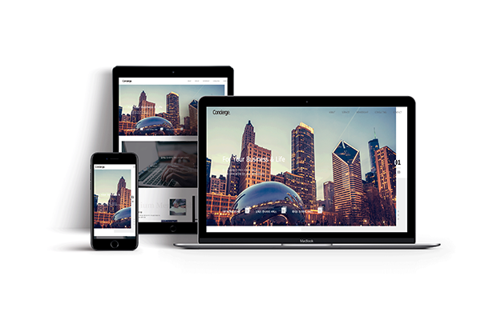

<h1>📌 DopDa 클론코딩</h1>

<h3>컨시어지 돕다</h3>

<h2>💻 Clone Coding </h2>

**글로벌 컨설팅 그룹, 돕다(Dopda)의 클론코딩 사이트입니다.**   GD WEB(지디웹) 선정작이며 반응형으로 제작하였습니다.   
Scrolla.js와 Slick.js를 사용하였습니다.

 

<h2>👀 클론코딩 사이트 보기 (Click to View) </h2>
👉 <a href="https://breeghty.github.io/Musign_clonecoding/">https://breeghty.github.io/Dopda_clonecoding/</a>

 

<h2>✔ 작업일자(Date)</h2>
2022.09.

 

<h2>✔ 키워드(Keyword)</h2>
- 클론코딩 100% 
- 웹표준, 웹접근성, 반응형웹 
- HTML, CSS, Javascript, jQuery 
- 레이아웃 연습, CSS 애니메이션

 

<h2>✔ 풀페이지(Full page)</h2>

